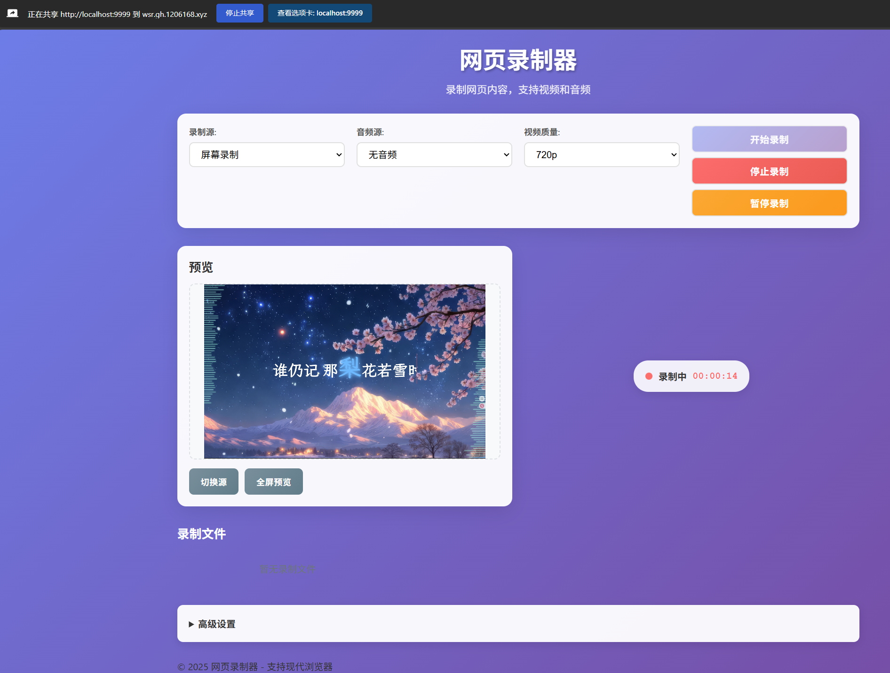

web-screen-recorder
-------------------

[中文](README.md)

> This is a powerful web-based recording tool, similar to [OBS](https://obsproject.com/), that can record screen, webcam, and audio directly in the browser.

## 🚀 Key Features

### 📹 Source Selection

- **Screen Recording**: Record the entire screen or choose a specific window
- **Webcam Recording**: Record from the connected webcam
- **Tab Recording**: Record only the current browser tab

### 🎵 Audio Support

- **No Audio**: Video-only recording
- **Microphone**: Record microphone audio
- **System Audio**: Record system sound (where supported by the browser)
- **Mixed Audio**: Record both microphone and system audio simultaneously

### 🎛️ Advanced Settings

- **Video Quality**: Supports 360p, 720p, 1080p, 1440p
- **Frame Rate**: Adjustable from 1 to 60 fps
- **Bitrate Control**: Adjustable from 1 to 20 Mbps
- **Recording Controls**: Start, stop, pause/resume recording

### 💾 File Management

- **Local Storage**: Recording files indexed/stored locally in the browser
- **Playback Preview**: Play recorded videos in the browser
- **Download**: Download recorded files to local disk
- **File Management**: Delete unwanted recordings

## 🛠️ Technical Details

### Core Technologies

- **MediaRecorder API**: Native browser recording API
- **MediaDevices API**: Device access and media stream control
- **localStorage**: Local index storage for recordings
- **WebM Format**: Efficient video container/encoding

### Compatibility

- **Modern Browsers**: Chrome 69+, Firefox 66+, Edge 79+
- **Mobile Devices**: Partial support (primarily desktop-focused)
- **HTTPS Recommended**: Best used in secure contexts

## 📖 Usage Guide

### Quick Start

1. Open the `www/index.html` file (local open may not work; deploy to an HTTPS site — demo site: [WSR](https://wsr.gh.1206168.xyz))
2. Choose the recording source (screen/webcam/tab)
3. Choose the audio source (if needed)
4. Adjust video quality settings
5. Click "Start Recording"
6. Click "Stop Recording" when finished

### Advanced Features

- **Pause Recording**: Pause and resume during a recording session
- **Full-Screen Preview**: Click the fullscreen button to view a larger preview
- **Source Switching**: Switch between different recording sources
- **File Management**: Manage recordings in the file list

### Settings

- **Frame Rate**: Affects smoothness; 30 fps is suitable for most cases
- **Bitrate**: Affects quality; 5–10 Mbps offers good quality
- **Video Quality**: Choose resolution according to needs

## ⚠️ Notes

### Permission Requirements

- User permission is required for camera and microphone access
- Screen recording requires user selection of the screen/window to capture
- HTTPS is recommended for best compatibility

### Performance Considerations

- High resolution and high frame rate consume more system resources
- Long recordings create large files
- Regularly clean up unneeded recordings

### Browser Limitations

- Safari support is limited
- Some mobile browsers may not support all features
- System audio capture compatibility varies by browser

## 🐛 Troubleshooting

### Common Issues

**Cannot start recording**

- Check if the browser supports the MediaRecorder API (or open the online test page at `www/test.html`), demo test page: [https://wsr.gh.1206168.xyz/test.html](https://wsr.gh.1206168.xyz/test.html)
- Ensure camera/microphone permissions are granted
- Try refreshing the page and re-authorizing

**Audio recording fails**

- Verify the microphone is working
- Ensure the browser supports system audio capture
- Try selecting a different audio source

**Recorded files too large**

- Lower video resolution
- Reduce frame rate
- Lower bitrate settings

**Preview is black**

- Check if the device is being used by another application
- Ensure the correct recording source is selected
- Try re-authorizing device permissions

## 📄 License

This project is licensed under the MIT License — see the [LICENSE](LICENSE) file for details.

## 🤝 Contributing

Contributions via Issues and Pull Requests are welcome!

## 📞 Contact

For questions or suggestions:
- Open a [GitHub Issue](https://github.com/ycrao/web-screen-recorder/issues/new)
- Email the project maintainer